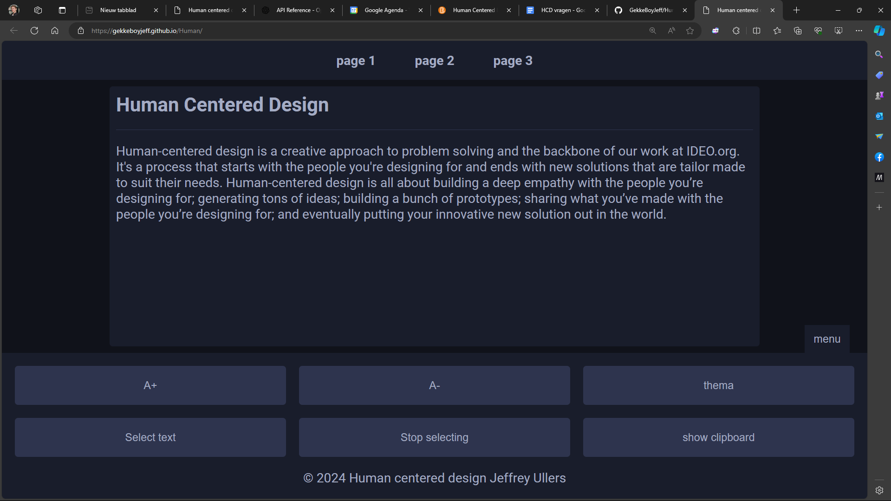

## week 1

### Casus

De casus gaat over Nicolette Besemer. Nicolette kan beperkt gebruik maken van haar ledematen. Ze gebruikt een rolstoel om zich te verplaatsen, en op haar computer maakt ze gebruik van spraaksoftware en een tekentablet in plaats van een muis. Dit maakt navigeren lastig omdat ze geen snelkoppelingen kan gebruiken.
De opdracht is om een website te maken die Nicolette kan gebruiken. De website moet toegankelijk zijn voor Nicolette.

### week 1

Ik ben begonnen met het maken van een repository op github. Kort daarna moesten wij (de mensen die deze casus hebben) alvast een begin maken aan de website zonder de hele casus te begrijpen. De groep en ik hebben vragen opgesteld die wij konden vragen aan de opdrachtgever (Nicolette) op dag 2.
Op deze dag heb ik een begin gemaakt aan de website. Ik heb een index.html aangemaakt en een style.css. Ik heb de basis van de website gemaakt. waarop ik een prototype kon maken waarmee Nicolette makkelijker kon selecteren.

Op dag 2 hebben wij ons eerste gesprek kunnen voeren met Nicolette. Hier hebben wij de vragen kunnen stellen die wij hadden opgesteld. Nicolette heeft ons veel informatie gegeven over wat zij fijn vindt en wat zij niet fijn vindt. Met name over hoe slecht zij kan navigeren op websites. Wat mij voornamelijk opviel is dat zij informatie zocht op één website waarbij het zoeken niet goed werkte. Dit was voor haar erg frustrerend. Hierdoor vond zij de informatie niet.



### week 2

In deze week heb ik gewerkt aan de functionaliteiten inbouwen in de website. Ik heb een menu gemaakt die Nicolette kan gebruiken om bijvoorbeeld de tekst groter te maken. Ik ben begonnen met het gebruiken van de chatGPT Api. Hiermee kan Nicolette vragen stellen aan de website. De website kan dan antwoord geven op de vraag. Dit is handig voor Nicolette omdat zij dan niet hoeft te zoeken naar informatie. Echter heeft dit heel veel tijd gekost om te implementeren.

```js
async function OpenaiFetchAPI() {
  const url =
    "https://nodejs-serverless-function-express-kappa-rouge.vercel.app/api/hello";

  const userContent = "Kun je me een grap vertellen?";

  const response = await fetch(url, {
    method: "POST",
    headers: {
      "Content-Type": "application/json",
    },
    body: JSON.stringify({
      userContent,
    }),
  });

  const data = await response.json();

  console.log(data); // Bevat de response van de OpenAI API
}

OpenaiFetchAPI();
```

### week 3

Ik vond dat ik aardig wat progressie had gemaakt op basis van functionaliteiten. Het lukte allemaal niet even goed met de chatGPT api en weet heel eerlijk gezegd niet zo goed meer waarom ik die hoe dan ook wou implementeren.

De test was een ramp. Ik ben erachter gekomen dat het selecteren van tekst niet ideaal is als je twee punten moet selecteren aangezien ze per ongeluk sleept terwijl ze klikt. Dit is een probleem die ik niet had voorzien.
Verder bleek uit de testen van de anderen dat een venster om de tekst in te plakken handig is als concept voor mevrouw.
Verder heeft iemand anders via een plugin het mogelijk gemaakt op via toetsaanslagen op haar wacom tablet handelingen zoals kopieren en plakken te doen. Ik ben benieuwd of dat mij ook gaat lukken maar dan zonder plugin.

<!-- Reflecteerd wat je hebt gedaan op de design principles. -->
<!-- ik moet nog dingen toevoegen zoals het plakken en delen. -->
<!--  wat heb ik gedaan, wat het probleem was en wat ik daar precies voor heb gedaan -->
