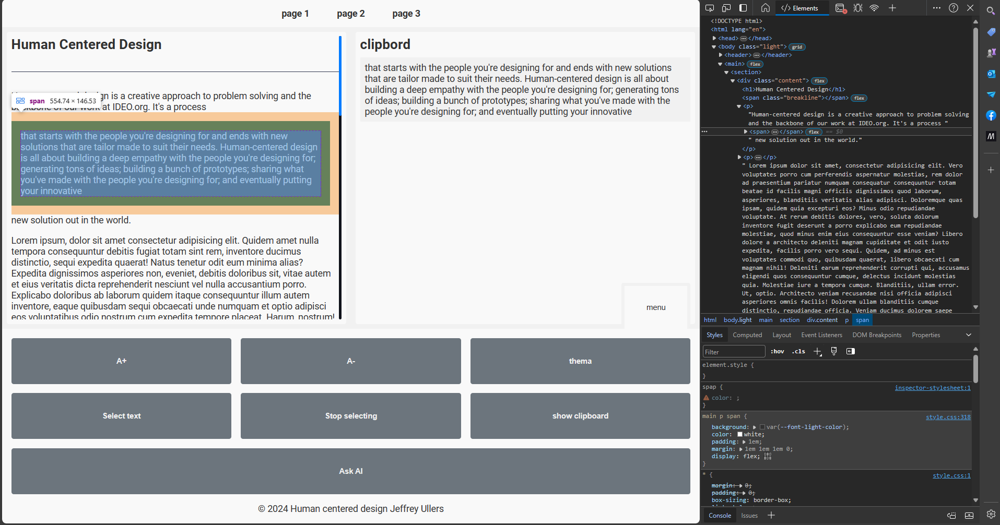

# Ontwerpen voor Nicolette Besemer

Nicolette, 76 jaar oud, ervaart dagelijkse hindernissen door haar neurologische aandoening. Fijne motoriek is beperkt, waardoor precisie op het scherm een uitdaging vormt. Ze lijd aan Axonale polyneuropathie wat inhoudt dat zij heel beperkt gebruik kan maken van haar ledematen.
Ze zit ook in een rolstoel en kan haar handen niet goed gebruiken. Ze maakt gebruik van een spraaksoftware en een tekentablet in plaats van een muis. Dit maakt navigeren lastig omdat ze geen snelkoppelingen kan gebruiken van het toetsenbord.

## Oplossing

De afgelopen weken heb ik gewerkt aan een prototype dat het web simuleert. Echter zit het web in een container en heb ik eromheen gebouwd. Zo heeft ze nu een uitklapbaar menu voor opties om de teksten groter en kleiner te maken, kan ze teksten selecteren met een aantal makkelijke drukken, deze worden dan opgeslagen in een clipboard en kan ze deze plakken waar ze maar wilt. Door middel van social media knoppen of als het haar wel lukt met haar pen, die te gebruiken op andere websites.

Ze hoeft niet meer te draggen om een tekst te selecteren want dat gaat niet, ze kan twee punten selecteren en alle tekst daartussen word geselecteerd. Dit is een stuk makkelijker voor haar.

Om het nog makkelijker te maken heb ik haar de optie gegeven om de tekst te vergroten en verkleinen.

# Wiki

# Casus

De casus gaat over Nicolette Besemer. Nicolette kan beperkt gebruik maken van haar ledematen. Ze gebruikt een rolstoel om zich te verplaatsen, en op haar computer maakt ze gebruik van spraaksoftware en een tekentablet in plaats van een muis. Dit maakt navigeren lastig omdat ze geen snelkoppelingen kan gebruiken.
De opdracht is om een website te maken die Nicolette kan gebruiken. De website moet toegankelijk zijn voor Nicolette.

## Inzichten uit onderzoek/interview

### Beperkingen

- Nicolette heeft een neurologische aandoening waardoor ze haar vingers niet goed kan gebruiken en geen gevoel heeft in haar handen.
- Ze kan niet met een muis of trackpad omgaan, en heeft moeite met het bedienen van een toetsenbord.
- Ze ervaart problemen met het scrollen, selecteren en knippen/plakken van tekst.
- Navigeren op websites is voor haar een grote uitdaging.

### Huidige hulpmiddelen

- Nicolette gebruikt een tekentablet met stylus om haar computer te bedienen.
- Ze heeft haar computer ingesteld met aanpassingen die haar gebruik vergemakkelijken, zoals het vergroten van tekst en het gebruik van één klik in plaats van dubbelklikken.

### Pijnpunten

- Nicolette kan tekst niet eenvoudig van de ene website naar de andere kopiëren en plakken.
- Ze vindt het moeilijk om items te selecteren, vooral kleine stukjes tekst.
- Navigeren op websites is frustrerend en tijdrovend.
- Ze mist handige functies zoals drag-and-drop.

### Wensen

- Nicolette wil graag een oplossing die het knippen en plakken van tekst eenvoudiger maakt.
- Ze wil graag websites op een efficiëntere manier kunnen navigeren.
- Ze is open voor nieuwe technologieën die haar kunnen helpen bij haar werk.
- De oplossing moet gebruiksvriendelijk zijn en een minimale leercurve hebben.

### Prioriteiten

- Gebruiksgemak is belangrijker dan snelheid.

## Besluit

Ik heb besloten mij te focussen op het kopieren en plakken van de teksten op de website, dit is een groot probleem voor haar.

# Resultaten uit eerste test

Bij de eerste test had ik al een aardig opsetje gemaakt, Nicolette kon hier de eerste versie zien van mijn oplossing waarin zij een tekst kon kopieren en plakken.


## Belangrijke inzichten uit de test:

- Ze was onder de indruk van de look en feel van de website, ze vond het leuk dat er een menu onderin stond die ze kon openklappen voor extra opties, echter vond ze het menu icoontje niet logisch.
- Ze vond het leuk dat ze met spraak het kopieer commando kon aanroepen
- Ze vond het vervelend dat ze niet kon zien wat ze gekopieerd had
- Ze vond het lastig dat ze het later niet kon terugvinden en er geen mogelijkheid was om te delen.

Veel meer informatie gaf ze niet uit deze korte feedback sessie

# Resultaten uit tweede test

## Werkzaamheden vooraf

### OpenAI text to speech

Voor het maken van de tweede test heb ik mij verdiept in het gebruiken van chatGPT als hulpmiddel. Echter kreeg ik dit niet goed werkend voor de test. Het ging mij met name over de informatie die zij zocht op websites omdat deze informatie vaak niet helder werd aangegeven. Denk hierbij aan het opzoeken van een locatie waar je speciale fietsen in Amsterdam kan parkeren. De website van Amsterdam bied hier geen duidelijke informatie over.
Helaas heb ik dit niet goed kunnen aanvullen met informatie vanuit chatGPT omdat deze informatie erbij verzon dat niet bestond. (Zie code hieronder)

```js
async function OpenaiFetchAPI(userContent) {
  console.log("Calling GPT3 with user content:", userContent);

  const url = "https://api.openai.com/v1/chat/completions";
  // const url = "https://api.openai.com/v1/assistants"
  const bearer =
    "Bearer " + "sk-proj-rIZggO9BySAh7eDfaDEXT3BlbkFJzLbhazvw4XpSFAq5hFM1";

  const body = JSON.stringify({
    model: "gpt-3.5-turbo",
    temperature: 1,
    top_p: 1,
    max_tokens: 2048,
    messages: [
      {
        role: "system",
        content:
          "Je bent een behulpvolle assistent die vragen beantwoordt over het web. Wees uitgebreid, duidelijk en vriendelijk mogelijk en probeer de vragen zo goed mogelijk te beantwoorden met heel veel informatie en details over de vraag. Dus als iemand vraagt om een locatie, geef aan waar, biedt details over de plek inclusief dingen waar ze voor uit moet kijken. Je spreekt mij aan als Nicolette. Je houdt rekening met het feit dat ik een oude vrouw ben, slecht te been ben en dus in een rolstoel zit en dat ik geen computermuis kan gebruiken waardoor ik alles met een tekentablet moet doen",
      },
      {
        role: "user",
        content: userContent,
      },
    ],
  });

  const response = await fetch(url, {
    method: "POST",
    headers: {
      "Content-Type": "application/json",
      Authorization: bearer,
      // 'OpenAI-Beta': 'assistants=v1',
    },
    body,
  });

  const data = await response.json();
  console.log(data); // Bevat de response van de OpenAI API
  console.log(data.choices[0].message.content); // Bevat de response van de OpenAI API
}
```

Zelfs met het expliciet aangeven wat chatGPT moest terug geven kreeg ik niet de response die ik wou hebben.
Deze waren:

- Afgekapt ookal heb ik de token length heel hoog gezet.
- Hadden met wat compleet anders te maken.
- Gaf geen duidelijke informatie.

### Gebruikersvriendelijkheid

Gezien het feit dat Nicolette wat ouder is en soms moeite heeft met dingen bijvoorbeeld te lezen vanwege bijvoorbeeld de tekstgrootte heb ik knoppen gemaakt die de teksten groter en kleiner kunnen maken. Deze data sla ik lokaal op in haar local storage

```js
let currentFontSize = parseInt(localStorage.getItem("fontSize")) || 16;
const maxFontSize = 64;

enlarge.addEventListener("click", () => {
  currentFontSize += 8;
  if (currentFontSize >= maxFontSize) {
    currentFontSize = maxFontSize;
  }

  document.querySelector("main").style.fontSize = `${currentFontSize}px`;
  localStorage.setItem("fontSize", currentFontSize);
});
```

## De test.


Bij de tweede test heeft Nicolette met mijn prototype kunnen spelen. Dit was **één grote ramp**.
Uit de eerdere tests en informatie bleek dat Nicolette wel kun drukken op elementen, echter bleek dat niet zo te zijn uit mijn nieuwe test.

- Het ging fout bij het selecteren van de tekst. In plaats van dat zij drukt, sleept ze over een element heen waardoor mijn applicatie compleet niet functioneerde zoals gedacht. Soms drukt ze ook twee keer per ongeluk achter elkaar waardoor dat ook als selectie word gezien.
- Mijn tekst vergroten en verkleinen werkte niet optimaal waardoor de tekst direct naar 64 pixels sprong.

### De positieve resultaten uit de test

- Het groter en kleiner maken van de tekst vond ze wel fijn.
- Het klipbord idee vond ze geweldig maar miste extra deelfunctionaliteit naar bijvoorbeeld facebook.
- De thema switcher was ze heel blij mee.

## Provide a unique experience

Ik heb een unieke ervaring gecreeerd door een layout te maken die voor haar als container dient. De main sectie dient als pagina wrapper. De uitschuifbare menu's (knoppen en klipboard) dient als toevoeging op haar browser waardoor ze altijd kan zien wat zij heeft gekopieerd. Door knoppen toe te voegen waarmee ze:

- De tekstgrootte kan veranderen en makkelijker de woorden kan selecteren
- Een klipbord toe te voegen waarmee ze altijd terug kan kijken wat ze geselecteerd heeft en het opnieuw kan delen met de benodigde knoppen op verschillende sociale media kanalen.

## Ignore conventions

Door een interface te maken met grote knoppen is dit van toepassing op alle aparaten die zij gebruikt, zowel mobiel als laptop hebben een mooi responsief design. Hierdoor hoeft ze niet meer op een normale manier te kopieren en te plakken, ze kan alles met een klik op de knop uitvoeren.

## Be inconsistent/innovative

Nicolette moest wel even wennen aan de interface, omdat er normaal nooit een knop vast op de onderkant staat van een pagina waarmee ze meerdere onderdelen van de website kan bedienen is dit even wennen.

## Prioritize identity

De meest moeilijke taken voor Nicolette waren het knippen en plakken, ze mistte hier de mogelijkheid in en in de beginfase miste zij duidelijkheid in wanneer ze nou op welke stap was.

## Add nonsense

Ze heeft er niet om gevraagd maar ik heb voor haar een thema switcher ingebouwd zodat het rustiger op haar ogen is.

## Provide a unique experience

Ik heb een unieke ervaring gecreeerd door een layout te maken die voor haar als container dient. De main sectie dient als pagina wrapper. De uitschuifbare menu's (knoppen en klipboard) dient als toevoeging op haar browser waardoor ze altijd kan zien wat zij heeft gekopieerd. Door knoppen toe te voegen waarmee ze:

- De tekstgrootte kan veranderen en makkelijker de woorden kan selecteren
- Een klipbord toe te voegen waarmee ze altijd terug kan kijken wat ze geselecteerd heeft en het opnieuw kan delen met de benodigde knoppen op verschillende sociale media kanalen.

## Ignore conventions

Door een interface te maken met grote knoppen is dit van toepassing op alle aparaten die zij gebruikt, zowel mobiel als laptop hebben een mooi responsief design. Hierdoor hoeft ze niet meer op een normale manier te kopieren en te plakken, ze kan alles met een klik op de knop uitvoeren.

## Be inconsistent/innovative

Nicolette moest wel even wennen aan de interface, omdat er normaal nooit een knop vast op de onderkant staat van een pagina waarmee ze meerdere onderdelen van de website kan bedienen is dit even wennen.

## Prioritize identity

De meest moeilijke taken voor Nicolette waren het knippen en plakken, ze mistte hier de mogelijkheid in en in de beginfase miste zij duidelijkheid in wanneer ze nou op welke stap was.

## Add nonsense

Ze heeft er niet om gevraagd maar ik heb voor haar een thema switcher ingebouwd zodat het rustiger op haar ogen is.

# TE WEINIG TIJD!!!

Het is super leuk om voor één specifiek persoon te ontwerpen. Ik ben de afgelopen weken ook echt met volle plezier aan de slag gegaan met de code. Ik ben echter veels te lang met "Add nonsense" bezig geweest en dat heb ik uiteindelijk niet kunnen uitwerken hoe ik dat wou. Ik wou namelijk dat zij een gesprek kon voeren met AI over een bepaald onderwerp. Helaas vanwege de rare of afgekapte opmerkingen die ik terug kreeg van OpenAI heb ik dit niet kunnen realiseren.

De testen verliepen anders dan gehoopt maar toch ben ik er blij mee. Zo zie je maar weer dat niet alles voor iedereen even duidelijk en makkelijk is. Want ik zou denken dat zij makkelijk kan drukken maar omdat ze niet weet of ze gedrukt heeft (omdat ze het niet voelt) word het voor haar enorm lastig om de applicatie goed te gebruiken. Daar ging ik enorm mee op mijn bek bij de laatste test.

Je bent dus constant bezig met een persoon als je exclusief ontwerpt omdat je eigen ervaringen toch altijd in de weg zitten! Niet iedereen is hetzelfde en dat haal je hier echt enorm uit!

Ik heb geprobeerd haar pijnpunten aan te pakken voor zover ik hier de tijd nog voor had. Ik had hier **veel** meer voor willen doen maar ik had mijn tijd moeten opdelen in maximaal aantal tijden dat ik eraan mog besteden zodat ik het wellicht kon schrappen voor een ander idee.

Met mijn oplossing kan zij vrijwel heel makkelijk haar teksten delen met andere mensen op zowel whatsapp en twitter. Ook word dit gekopieerd naar haar
